# Agent/Crew Optimization Process and Data Lifecycle

This diagram illustrates the complete process of optimizing AI agents and crews using the automated prompt optimization system, including the lifecycle of datasets and evaluation runs.

## Process Overview

```mermaid
graph TB
    Start([User Wants to Optimize Agent/Crew])

    %% Type Detection Phase
    Start --> Detect{Detect Type}
    Detect -->|Check crews/*/config/| CrewAI[CrewAI Crew<br/>YAML configs]
    Detect -->|Check agents/*/*.py| LangGraph[LangGraph Agent<br/>Python prompts]

    %% Dataset Discovery Phase
    CrewAI --> ListDS[List Existing Datasets<br/>resources/list_datasets.py]
    LangGraph --> ListDS

    ListDS --> HasDS{Suitable<br/>Dataset<br/>Exists?}

    %% Dataset Creation Branch
    HasDS -->|No| CreateChoice{Create From?}
    CreateChoice -->|Production Traces| FindTraces[Find Production Traces<br/>resources/find_traces.py]
    FindTraces --> ExtractTools[Extract Tool Calls<br/>for Replay]
    ExtractTools --> CreateFromTraces[Create Dataset from Traces<br/>resources/create_dataset_from_traces.py]

    CreateChoice -->|Scratch| CreateManual{Method?}
    CreateManual -->|JSON File| JSONFile[Prepare test_cases.json]
    CreateManual -->|Interactive| Interactive[Interactive Mode]
    JSONFile --> CreateFromScratch[Create Dataset from Scratch<br/>resources/create_dataset_from_scratch.py]
    Interactive --> CreateFromScratch

    CreateFromTraces --> DSCreated[(Dataset Created<br/>agent_scenario_dataset)]
    CreateFromScratch --> DSCreated

    %% Existing Dataset Branch
    HasDS -->|Yes| SelectDS[(Select Dataset<br/>agent_scenario_dataset)]

    DSCreated --> DSReady[(Dataset Ready)]
    SelectDS --> DSReady

    %% Factory Function Creation
    DSReady --> FactoryChoice{Agent Type}
    FactoryChoice -->|LangGraph| CreateLGFactory[Create Factory Function<br/>in evaluation/agent_name/<br/>agent_factory.py]
    FactoryChoice -->|CrewAI| CreateCIFactory[Create Factory Function<br/>in evaluation/crew_name/<br/>crew_factory.py]

    CreateLGFactory --> FactoryReady[Factory Function Ready]
    CreateCIFactory --> FactoryReady

    %% Baseline Run
    FactoryReady --> RunBaseline[Run Baseline Evaluation<br/>run_baseline.py]
    RunBaseline --> BaselineExec[EvaluationPipeline.run_evaluation]

    BaselineExec --> ToolReplay{Dataset Has<br/>Tool Calls?}
    ToolReplay -->|Yes| ReplayMode[Use Tool Replay<br/>Deterministic Evaluation]
    ToolReplay -->|No| LiveMode[Live Tool Execution<br/>Real API Calls]

    ReplayMode --> EvalItems[For Each Dataset Item]
    LiveMode --> EvalItems

    EvalItems --> RunAgent[Run Agent/Crew<br/>with Dataset Input]
    RunAgent --> Score[Score Output<br/>vs Expected]
    Score --> StoreTrace[(Store Trace<br/>in Langfuse)]
    StoreTrace --> MoreItems{More Items?}
    MoreItems -->|Yes| EvalItems
    MoreItems -->|No| BaselineComplete[(Baseline Run<br/>agent_scenario_baseline<br/>Score: 0.XX)]

    %% Optimization Loop
    BaselineComplete --> StartOpt[Start Optimization<br/>optimize_agent.py / optimize_crew.py]
    StartOpt --> OptLoop{Iteration N}

    OptLoop --> ReadCurrent[Read Current Prompts<br/>Python or YAML]
    ReadCurrent --> AnalyzeFailures[Analyze Low-Scoring Cases<br/>from Previous Run]
    AnalyzeFailures --> CallLLM[Call Claude to Suggest<br/>Prompt Improvements]
    CallLLM --> ModifyPrompts[Modify Prompts<br/>Python or YAML files]
    ModifyPrompts --> RunIter[Run Evaluation<br/>with Modified Prompts]

    RunIter --> IterExec[EvaluationPipeline.run_evaluation<br/>Same dataset, new prompts]
    IterExec --> IterComplete[(Iteration Run<br/>agent_scenario_opt_iter_N<br/>Score: 0.YY)]

    IterComplete --> CheckStop{Stop?}
    CheckStop -->|Score >= Threshold| OptDone[Optimization Complete]
    CheckStop -->|Max Iterations| OptDone
    CheckStop -->|Converged| OptDone
    CheckStop -->|No| IncIter[N = N + 1]
    IncIter --> OptLoop

    %% Final Phase
    OptDone --> UpdateLog[Auto-Update<br/>OPTIMIZATION_LOG.md]
    UpdateLog --> ComparePrompts[Show Before/After<br/>Prompt Comparison]
    ComparePrompts --> Results[Report Results<br/>Initial vs Final Score<br/>Improvement %]

    Results --> CommitChoice{Commit?}
    CommitChoice -->|Yes| CommitChanges[Commit Modified Prompts<br/>+ OPTIMIZATION_LOG.md]
    CommitChoice -->|Deploy| Deploy[Test in Staging/Prod]
    CommitChoice -->|Continue| MoreOpt[Create New Dataset<br/>or Refine Existing]

    CommitChanges --> End([Done])
    Deploy --> End
    MoreOpt --> ListDS

    %% Data Lifecycle Subgraph
    subgraph DataLifecycle["📊 Data Lifecycle"]
        direction TB
        ProdTraces[(Production Traces<br/>in Langfuse)]
        ProdTraces -->|Extract| DatasetItems
        DatasetItems[(Dataset Items<br/>input + expected_output<br/>+ tool_calls metadata)]
        DatasetItems -->|Used by| BaselineRun[(Baseline Run<br/>Traces + Scores)]
        BaselineRun -->|Feeds| OptRuns[(Optimization Runs<br/>iter_1, iter_2, iter_N)]
        OptRuns -->|Updates| PromptFiles[(Prompt Files<br/>Python or YAML)]
        PromptFiles -->|Committed to| GitHistory[(Git History)]
        OptRuns -->|Documents| OptLog[(OPTIMIZATION_LOG.md)]
        OptLog -->|Tracks| Lineage[Dataset → Baseline → Iterations<br/>Score progression<br/>Prompt changes]
    end

    %% Styling
    classDef dataset fill:#e1f5ff,stroke:#0288d1,stroke-width:2px
    classDef run fill:#fff9c4,stroke:#f57f17,stroke-width:2px
    classDef decision fill:#ffecb3,stroke:#ff6f00,stroke-width:2px
    classDef action fill:#f3e5f5,stroke:#7b1fa2,stroke-width:2px
    classDef file fill:#c8e6c9,stroke:#388e3c,stroke-width:2px

    class DSCreated,DSReady,SelectDS,DatasetItems dataset
    class BaselineComplete,IterComplete,BaselineRun,OptRuns run
    class Detect,HasDS,CreateChoice,CheckStop,ToolReplay decision
    class RunBaseline,StartOpt,CallLLM,ModifyPrompts action
    class PromptFiles,OptLog,GitHistory file
```



## Key Phases

### 1. Type Detection
- **LangGraph Agents**: Single Python file with `system_prompt = """..."""`
- **CrewAI Crews**: Multiple YAML configs (`agents.yaml`, `tasks.yaml`)

### 2. Dataset Management
- **List Existing**: Check Langfuse for available datasets
- **Create from Traces**: Extract real production scenarios with tool replay
- **Create from Scratch**: Manual test cases via JSON or interactive mode

### 3. Baseline Establishment
- Run evaluation with current prompts
- Store traces and scores in Langfuse
- Use tool replay if available (deterministic evaluation)

### 4. Optimization Loop
- Analyze low-scoring cases
- Generate improved prompts using Claude
- Test new prompts on same dataset
- Repeat until convergence or threshold reached

### 5. Documentation & Deployment
- Auto-update `OPTIMIZATION_LOG.md`
- Compare before/after prompts
- Commit changes to Git
- Deploy to staging/production

## Data Lifecycle

The data flows through the following stages:

```
Production Traces
    ↓ (extract)
Dataset Items (with tool_calls metadata)
    ↓ (evaluate)
Baseline Run (initial score)
    ↓ (optimize)
Iteration Runs (improved scores)
    ↓ (update)
Prompt Files (Python/YAML)
    ↓ (commit)
Git History
```

## Naming Convention

All datasets and runs follow a consistent naming pattern:

- **Dataset**: `{agent_name}_{dataset_name}_dataset`
  - Example: `accessibility_agent_edge_cases_dataset`

- **Baseline**: `{agent_name}_{dataset_name}_baseline`
  - Example: `accessibility_agent_edge_cases_baseline`

- **Iterations**: `{agent_name}_{dataset_name}_opt_iter_{N}`
  - Example: `accessibility_agent_edge_cases_opt_iter_1`

## Tool Replay

When datasets include `tool_calls` metadata:
- ✅ Deterministic evaluation (no API variability)
- ✅ Faster runs (no external API calls)
- ✅ Fair comparison (only prompts change)
- ✅ Cost savings (no repeated API calls)

## Stopping Criteria

Optimization stops when:
- **Score Threshold**: Achieved target score (e.g., 0.75)
- **Max Iterations**: Reached iteration limit (e.g., 3)
- **Convergence**: Score improvement < threshold (e.g., 0.05)

## Related Documentation

- [PROMPT_OPTIMIZATION.md](PROMPT_OPTIMIZATION.md) - Complete technical documentation
- [TOOL_REPLAY.md](TOOL_REPLAY.md) - Tool replay guide
- [QUICKSTART.md](QUICKSTART.md) - Quick start examples
- [unified_optimization_flow.md](unified_optimization_flow.md) - Detailed flow diagrams
- [crewai_optimization_flow.md](crewai_optimization_flow.md) - CrewAI-specific details
