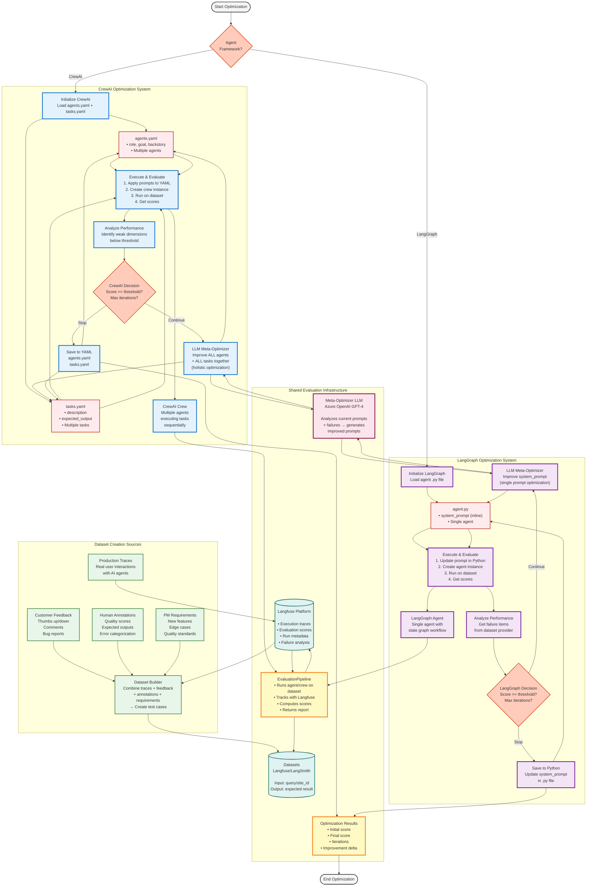

# Unified Prompt Optimization Flow
## CrewAI + LangGraph Self-Improving AI Agents

This diagram shows the complete prompt optimization system supporting both CrewAI crews and LangGraph agents, including dataset creation from production traces, customer feedback, and PM requirements.



## Dataset Creation Pipeline

The optimization system uses evaluation datasets that combine multiple sources of real-world data to create comprehensive test cases.

### 1. Production Traces (Langfuse)

**Source**: Real user interactions with AI agents in production

Production traces capture:
- **User inputs**: Actual queries from customers
- **Agent outputs**: Real responses from deployed agents
- **Tool calls**: Tool invocations with input parameters and outputs
- **Execution metadata**: Timestamps, latency, model used, costs
- **Conversation context**: Full chat history and session data

Example trace:
```json
{
  "trace_id": "trace_abc123",
  "input": {
    "query": "Show me opportunities for adobe.com",
    "site_id": "adobe.com"
  },
  "output": {
    "opportunities": [...],
    "count": 15
  },
  "metadata": {
    "duration_ms": 2340,
    "model": "gpt-4",
    "cost": 0.0234
  },
  "observations": [
    {
      "type": "TOOL",
      "name": "SpaceCatTrafficAnalyzer",
      "input": {"url": "adobe.com"},
      "output": {"traffic": 1000000, "growth": 5.2}
    }
  ]
}
```

### 2. Customer Feedback

**Source**: Direct user feedback on AI agent responses

Customer feedback includes:
- **Thumbs up/down**: Binary quality signals
- **Comments**: Free-text feedback explaining issues
- **Bug reports**: Specific problems encountered
- **Feature requests**: Desired improvements

Feedback is attached to traces in Langfuse:
```json
{
  "trace_id": "trace_abc123",
  "feedback": {
    "score": 0,  // thumbs down
    "comment": "The response missed 3 critical accessibility issues",
    "submitted_by": "user@company.com",
    "timestamp": "2025-01-15T10:30:00Z"
  }
}
```

### 3. Human Annotations

**Source**: Expert reviewers and QA team

Human annotations enrich traces with:
- **Quality scores**: Expert ratings (1-5 or 0-100)
- **Expected outputs**: What the correct answer should be
- **Error categorization**: Type of failure (hallucination, incomplete, incorrect)
- **Severity levels**: Critical, high, medium, low

Annotation example:
```json
{
  "trace_id": "trace_abc123",
  "annotations": {
    "quality_score": 3,
    "expected_output": {
      "opportunities": [...],  // Correct list
      "count": 18  // Actual count
    },
    "error_type": "incomplete_data",
    "severity": "high",
    "notes": "Missed 3 opportunities with broken links",
    "annotator": "qa_team_member"
  }
}
```

### 4. PM Requirements

**Source**: Product Management specifications

PM requirements define:
- **New features**: Capabilities to be added
- **Edge cases**: Scenarios that must be handled
- **Quality standards**: Minimum acceptable performance
- **Success criteria**: What "good" looks like

PM requirement example:
```yaml
feature: alt_text_detection
requirements:
  - Must detect missing alt text on all image types (img, svg, picture)
  - Must prioritize by page importance (homepage > product > blog)
  - Must provide actionable fix suggestions
  - Response time < 3 seconds for pages with 100+ images
edge_cases:
  - Images with empty alt="" (decorative)
  - Background images in CSS
  - Dynamic images loaded via JavaScript
quality_threshold:
  accuracy: >= 95%
  recall: >= 90%
  precision: >= 85%
```

### 5. Dataset Builder Process

The Dataset Builder combines all sources into structured test cases:

**Step 1: Collect Production Traces**
- Query Langfuse for recent traces
- Filter by agent/crew type
- Apply date range (e.g., last 30 days)

**Step 2: Enrich with Feedback & Annotations**
- Join traces with customer feedback
- Add human annotations from review queue
- Calculate aggregate quality scores

**Step 3: Synthesize from PM Requirements**
- Generate synthetic test cases for new features
- Create edge case scenarios
- Ensure coverage of all requirement dimensions

**Step 4: Extract Tool Calls (for Tool Replay)**

To enable deterministic evaluation, extract tool calls from traces:

```python
from evaluation.langfuse_tool_extractor import extract_tool_calls_from_trace

# Extract tool observations from the trace
tool_calls = extract_tool_calls_from_trace(trace.id)
# Returns: [{"tool_name": "...", "input": {...}, "output": {...}, ...}]
```

**Why Tool Replay?**

Tool results can vary between evaluation runs (APIs change, time-sensitive data), making it impossible to fairly compare different prompt versions. Tool replay captures tool responses from production and replays them during evaluation, ensuring:

- ✅ **Deterministic Results**: Same inputs = same outputs every time
- ✅ **Fair Comparison**: Only prompts change, tool responses stay constant
- ✅ **Faster Testing**: No need to call external APIs
- ✅ **Cost Effective**: Avoid repeated API calls

See [TOOL_REPLAY.md](TOOL_REPLAY.md) for complete documentation.

**Step 5: Create Dataset Items**
```python
dataset_item = {
    "input": {
        "query": trace.input.query,
        "site_id": trace.input.site_id
    },
    "expected_output": annotation.expected_output or pm_requirement.example_output,
    "metadata": {
        "source": "production_trace",
        "trace_id": trace.id,
        "feedback_score": feedback.score,
        "quality_score": annotation.quality_score,
        "requirement_id": pm_requirement.id,
        "tool_calls": tool_calls,  # Include for tool replay
        "created_at": now()
    }
}
```

**Step 6: Upload to Langfuse/LangSmith**
```python
from langfuse import Langfuse

client = Langfuse()
dataset = client.create_dataset(name="opportunities_detection_v2")

for item in dataset_items:
    client.create_dataset_item(
        dataset_name="opportunities_detection_v2",
        input=item["input"],
        expected_output=item["expected_output"],
        metadata=item["metadata"]
    )
```

### Dataset Evolution

Datasets evolve continuously:

```
Week 1: Initial dataset
├── 10 items from PM requirements
└── 5 items from manual testing

Week 2: Production integration
├── Previous 15 items
├── 20 items from production traces
└── 10 items with customer feedback

Week 3: Quality refinement
├── Previous 45 items
├── 15 items with human annotations
└── 5 new edge cases discovered

Week 4: Ongoing optimization
├── Previous 65 items
├── Remove outdated items (features changed)
├── Add 10 new items from latest PM specs
└── Update expected outputs based on new standards
```

### Example: Complete Dataset Item

```json
{
  "dataset_name": "contextual_greeter_dataset",
  "item": {
    "input": {
      "query": {
        "pageType": "opportunities_list",
        "user_name": "Sarah",
        "appName": "Experience Success Studio"
      }
    },
    "expected_output": "A warm greeting that acknowledges viewing opportunities and suggests filtering by urgency or priority",
    "metadata": {
      "sources": [
        {
          "type": "production_trace",
          "trace_id": "trace_xyz789",
          "date": "2025-01-10",
          "customer_feedback": {
            "score": 1,
            "comment": "Greeting was too generic, didn't help me"
          }
        },
        {
          "type": "human_annotation",
          "annotator": "ux_expert",
          "quality_score": 4,
          "notes": "Should mention filtering options explicitly"
        },
        {
          "type": "pm_requirement",
          "requirement_id": "REQ-123",
          "spec": "Greetings must suggest next actions relevant to page context"
        }
      ],
      "tool_calls": [
        {
          "tool_name": "Example Tool",
          "input": {"args": [5, 5], "kwargs": {}},
          "output": 10,
          "observation_id": "obs-abc123",
          "start_time": "2025-01-10T10:00:00Z"
        }
      ],
      "created_at": "2025-01-15T14:22:00Z",
      "version": "v2.1"
    }
  }
}

**Note on Tool Calls**: The `tool_calls` field contains recorded tool invocations from the original production trace. During evaluation, these can be replayed via `ToolReplayContext` to ensure deterministic results. See [TOOL_REPLAY.md](TOOL_REPLAY.md) for details.
```

## System Comparison

| Aspect | CrewAI System | LangGraph System |
|--------|---------------|------------------|
| **Configuration** | 2 YAML files (agents.yaml + tasks.yaml) | 1 Python file (inline system_prompt) |
| **Scope** | Multiple agents + multiple tasks | Single agent |
| **Optimization** | Holistic (all agents + tasks together) | Focused (single prompt) |
| **Complexity** | Higher (maintains agent-task coherence) | Lower (simpler prompt updates) |
| **File Format** | YAML (structured config) | Python (regex-based extraction) |
| **Use Case** | Multi-agent workflows | Single-agent state graphs |

## Common Components

### 1. Evaluation Pipeline
- **Purpose**: Run agents/crews on datasets and collect scores
- **Input**: Agent/crew factory function + dataset name
- **Output**: Evaluation report with scores per dimension
- **Platforms**: Langfuse or LangSmith

### 2. Datasets (Langfuse/LangSmith)
- **Structure**:
  - Input: `{"query": "...", "site_id": "..."}`
  - Expected Output: Ground truth or quality description
- **Examples**:
  - CrewAI: `{"pageType": "opportunities_list", "user_name": "John"}`
  - LangGraph: `{"query": "Find opportunities on adobe.com"}`

### 3. Meta-Optimizer LLM (Azure OpenAI GPT-4)
- **Role**: Analyzes current prompts + failures → generates improvements
- **Input**:
  - Current prompt(s)
  - Performance scores
  - Failure analysis
  - Optimization guidelines
- **Output**:
  - CrewAI: JSON with all agents + all tasks
  - LangGraph: New system_prompt string

### 4. Langfuse Platform
- **Tracing**: Records every agent/crew execution
- **Scoring**: Stores evaluation metrics per run
- **Analysis**: Provides failure dataset and run items
- **UI**: Visualize traces, compare runs, debug issues

## Optimization Loop (Common Pattern)

Both systems follow the same iterative pattern:

```
1. INITIALIZE
   ├─ Load current prompts (YAML or Python)
   └─ Set up optimization state

2. LOOP (until threshold or max iterations):
   │
   ├─ EXECUTE & EVALUATE
   │  ├─ Apply current prompts to config
   │  ├─ Create agent/crew instance
   │  ├─ Run on all dataset items
   │  └─ Collect scores from Langfuse
   │
   ├─ ANALYZE
   │  ├─ Identify dimensions below threshold
   │  └─ Analyze failure patterns
   │
   ├─ DECIDE
   │  ├─ If score >= threshold → SAVE & EXIT
   │  └─ If max iterations → SAVE & EXIT
   │
   └─ PROPOSE IMPROVEMENTS
      ├─ Send current config + failures to LLM
      ├─ LLM generates improved prompts
      └─ Update config for next iteration

3. FINALIZE
   ├─ Save best prompts to files
   └─ Return optimization report
```

## Data Flow Example

### CrewAI Flow
```
agents.yaml + tasks.yaml
  → CrewPromptBundle (2 agents + 2 tasks)
  → ContextualGreeterCrew
  → EvaluationPipeline
  → Langfuse (4 test cases)
  → Scores: {greeting_quality: 0.65, context_awareness: 0.70}
  → Average: 0.675
  → LLM: "Improve agent goals to be more specific..."
  → Updated YAML files
  → Next iteration...
```

### LangGraph Flow
```
sites_opportunities_agent.py
  → Extract system_prompt via regex
  → Create SitesOpportunitiesAgent
  → EvaluationPipeline
  → Langfuse (10 test cases)
  → Scores: {accuracy: 0.72, completeness: 0.68}
  → Average: 0.70
  → LLM: "Enhance prompt to emphasize data accuracy..."
  → Updated .py file
  → Next iteration...
```

## Key Differences in Implementation

### Prompt Storage
- **CrewAI**: YAML files, structured data, easy to parse
- **LangGraph**: Python files, regex extraction, in-place updates

### Optimization Scope
- **CrewAI**: Must optimize agents AND tasks together for coherence
- **LangGraph**: Optimize single prompt independently

### Complexity
- **CrewAI**: Higher - maintain relationships between agents/tasks
- **LangGraph**: Lower - single prompt, simpler meta-optimization

### Meta-Prompt Strategy
- **CrewAI**: "Optimize this crew holistically, ensure agent capabilities match task requirements"
- **LangGraph**: "Improve this system prompt to better handle these failure cases"

## Files Structure

```
app/evaluation/
├── prompt_optimizer_crewai.py      # CrewAI shared optimizer (generic optimize_crew function)
├── prompt_optimizer_langgraph.py   # LangGraph shared optimizer (generic optimize_agent function)
├── pipeline.py                      # Shared EvaluationPipeline
├── eval_runner.py                   # Dataset execution runner
├── dataset_providers.py             # Langfuse/LangSmith abstraction
├── evaluators.py                    # LLM-as-judge evaluators
├── <agent_name>/                    # Agent-specific evaluation folder
│   ├── agent_factory.py            # Agent factory function
│   ├── create_dataset.py           # Dataset creation script
│   ├── run_baseline.py             # Baseline evaluation script
│   ├── optimize_agent.py           # Optimization script
│   └── OPTIMIZATION_LOG.md         # Auto-generated optimization history
├── <crew_name>/                     # Crew-specific evaluation folder
│   ├── crew_factory.py             # Crew factory function
│   ├── create_dataset.py           # Dataset creation script
│   ├── run_baseline.py             # Baseline evaluation script
│   ├── optimize_crew.py            # Optimization script
│   └── OPTIMIZATION_LOG.md         # Auto-generated optimization history
└── PROMPT_OPTIMIZATION.md          # Documentation
```

**Note:** Agent/crew-specific factory functions and scripts go in their own `app/evaluation/<name>/` folder, NOT in the shared optimizer files.

## Usage Examples

### CrewAI
```python
result = await optimize_crew(
    config_dir="app/agents/crews/contextual_greeter/config",
    crew_func_factory=lambda: ContextualGreeterCrew(),
    dataset_name="contextual_greeter_dataset",
    max_iterations=3,
    score_threshold=0.8
)
```

### LangGraph
```python
result = await optimize_agent(
    agent_file_path="app/agents/crews/detection/sites_opportunities_agent.py",
    agent_func_factory=lambda: create_sites_opportunities_agent(),
    dataset_name="sites_opportunities_dataset",
    max_iterations=5,
    score_threshold=0.85
)
```

## Future Enhancements

Both systems can be extended with:
- Multi-objective optimization (balance multiple metrics)
- A/B testing (compare prompt variants)
- Prompt versioning (track history)
- Ensemble optimization (combine multiple strategies)
- Human-in-the-loop (manual approval of changes)
