# Stranger Things

## Unified Agentic System for ASO & LLMO

> **Last Updated:** 2026-02-05
> **Implementation Status:** ~85% of core infrastructure complete. See [implementation-plan.md](../implementation-plan.md)

---

# The Mission

**Scale to several thousand customers** with higher quality agents and expanded capabilities.

Our agentic system enables teams to create, run, evaluate, and improve agents with minimal friction, shifting effort from "software-centric" toward "learning-centric" (data and evaluation).

---

# Base Problems

| Problem | Description |
|---------|-------------|
| **Agent Quality** | Inconsistent results, no systematic improvement |
| **Agent Performance** | Slow, redundant computation |
| **Agent Testability** | Hard to test, must run whole pipeline |
| **Dual Stack Pains** | SpaceCat + Mystique integration friction |
| **Developer Experience** | Hard to create new oppties |
| **Developer Velocity** | Low feature velocity, steep learning curve |

---

# Impact of These Problems

**Customer Adoption**
- Blocked by agent quality and reliability
- UX issues amplified by underlying agent weaknesses

**Team Productivity**
- Dual-stack complexity slows everyone down
- Low feature velocity - hard to create new oppties
- Hard to test (need to test whole chain)

**Cost & Efficiency**
- COGS waste from redundant computation
- Token waste - every wasted token is capacity we can't use
- ~95% of audit runs are wasted (page unchanged)

---

# The Base Plan

| Plan Item | Solves |
|-----------|--------|
| **Data Service** | Dual Stack, Performance |
| **Blackboard & Facts** | Performance, Testability, Holistic Oppties |
| **Audit Migration (DRS + Mystique)** | Dual Stack, DX Velocity |
| **Eval Framework + Self-Learning** | Quality, Testability |

---

# Dependency Chain

Two parallel tracks after Data Service:

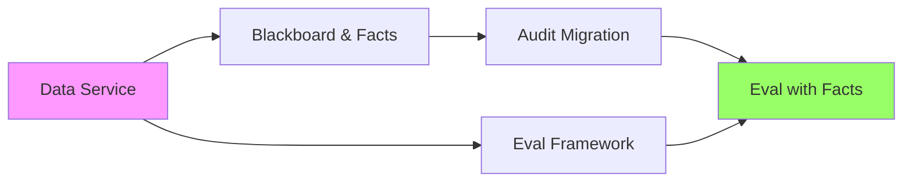

- **Track A:** Data Service → Blackboard → Audit Migration → Full eval integration
- **Track B:** Eval framework basics (can start now, doesn't need storage)

Tracks converge when migrated agents produce facts that feed into eval loops.

---

# Deep Dive: Data Service

---

# Current State: Fragmented Storage

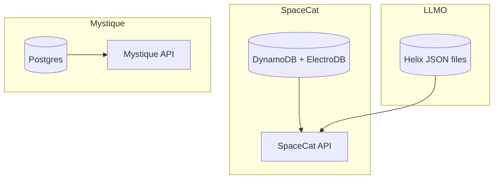

**Problems:**
- Three different storage systems
- No unified access patterns
- Inconsistent tenancy/security
- Hard to join data across systems

---

# Data Service

**Postgres as system of record** for everything:

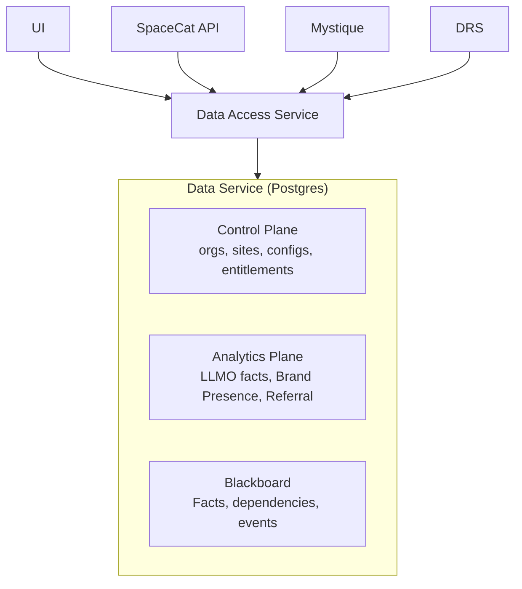

Optional: **ClickHouse** as analytics accelerator for high-scale aggregates.

> **Implementation Status (Feb 2026):**
> - ✅ Blackboard facts & dependencies in Postgres
> - ✅ Control Service configs (tenant, site, tier) in Postgres
> - ⏳ LLMO analytics tables - schema designed, not deployed
> - ⏳ Data Access Service as separate microservice - deferred; integrated in Mystique monolith
> - ⏳ ClickHouse integration - planned for Phase 2+

---

# Data Access Service

A dedicated service that owns:

| Responsibility | Description | Status |
|----------------|-------------|--------|
| **Schema + Migrations** | Single source of truth | ✅ In Mystique monolith |
| **Tenancy + Authorization** | Row-level security, tenant isolation | ✅ Implemented |
| **Query APIs** | Stable contracts for UI and services | ⏳ Internal only |
| **OpenAPI Contracts** | Generated TS + Python clients | ⏳ Planned |

**Current Architecture (Feb 2026):**
- Database in Mystique monolith (`app/db/`)
- Internal APIs: `/v1/control/*`, `/v1/blackboard/*`
- Customer-facing Data Access Service: planned Phase 2+

**Why eventually a separate service?**
- Many clients in many languages (TS + Python)
- Avoid direct DB coupling across services
- Centralize security and audit logging

---

# What Lives Where

| Data | Current | Unified |
|------|---------|---------|
| SpaceCat entities (orgs, sites, configs) | DynamoDB | Postgres |
| LLMO facts (Brand Presence, Agentic, Referral) | Helix JSON | Postgres |
| Mystique Blackboard (facts, dependencies) | Postgres | Postgres |

**Benefits:**
- Flexible filtering, joins, aggregations
- ACID + constraints + corrections
- Familiar tooling (Mystique already on Postgres)

---

# Deep Dive: Blackboard & Facts

---

# Current State: Isolated Pipelines

Each opportunity is a linear standalone process:

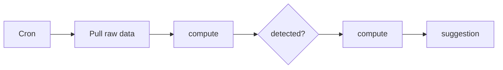

**Problems:**
1. Whole flow happens always, regardless of input changing
2. Intermediary results computed from scratch, then discarded
3. Outcomes independent - contradictory suggestions for same page
4. Each oppie team reimplements same fact computation

---

# Problem: Intermediary Results Discarded

Example intermediary results in HOTLCTR:

| Fact | Scope | Also computed in |
|------|-------|------------------|
| identify website type | site | 5 agents |
| identify industry type | site | 3 agents |
| identify page type | page | 6 agents |
| identify page intent | page | 6 agents |
| analyze desktop screenshot | page | 5 agents |
| analyze mobile screenshot | page | 5 agents |
| collect webpage context | page | 4 agents |

Running HOTLCTR takes **20 minutes locally** because everything recomputes.

---

# Blackboard Architecture

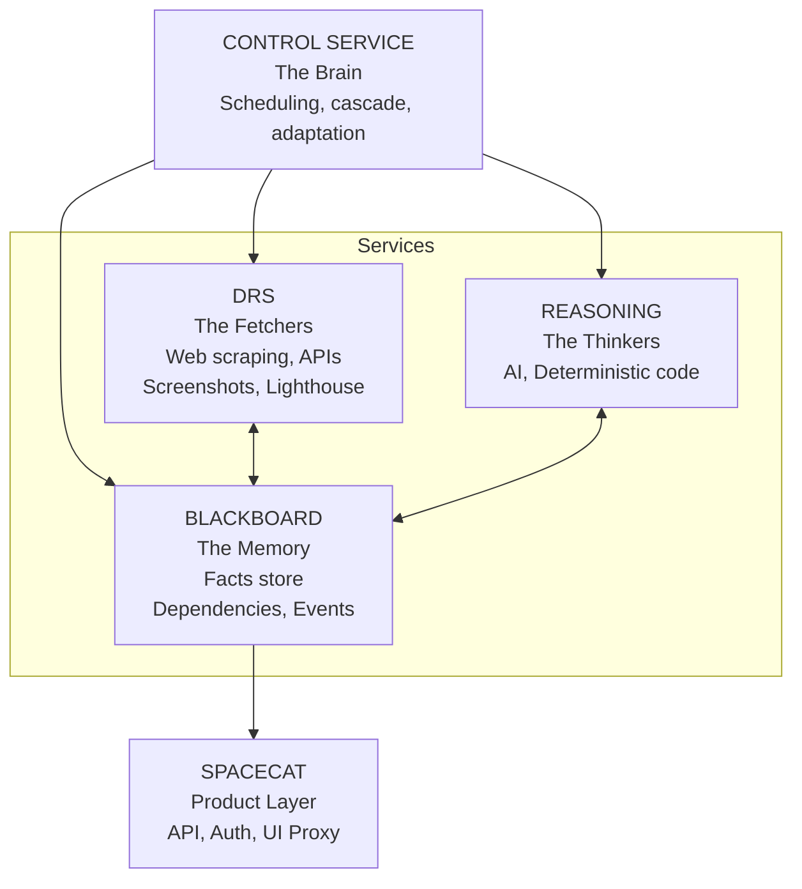

---

# The Four Services

| Service | Role | Metaphor |
|---------|------|----------|
| **Control** | Scheduling, policies, cascade | The Brain |
| **DRS** | Data fetching from outside | The Fetchers |
| **Blackboard** | Fact storage & dependencies | The Memory |
| **Reasoning** | AI + deterministic analysis | The Thinkers |

Key insight: Separate **what we know** (facts) from **how we compute** (deterministic code, one shot, agents, skills, or future tech)

---

# Facts: The Core Abstraction

**Three Fact Types:**

| Type | Description | TTL | Example |
|------|-------------|-----|---------|
| **Observation** | Raw data from external sources | 1-7 days | HTML, screenshot, CWV metrics |
| **Derived** | Intermediate AI analysis | 1-30 days | page_type, brand_profile |
| **Assertion** | Final recommendations | 1-7 days | "Add alt text to hero image" |

Facts are **typed**, **scoped**, and **have dependencies**.

---

# Hierarchical Scopes

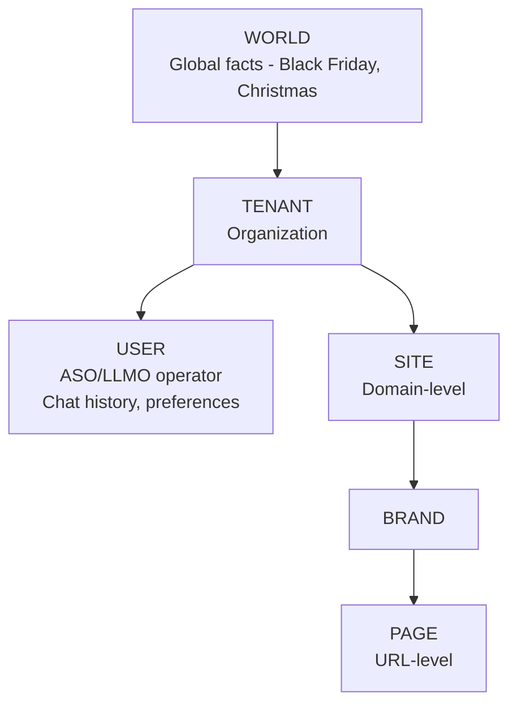

- **World** — Global facts (seasonal events, market conditions)
- **Tenant** — Organization-level (brand guidelines, preferences)
- **User** — ASO/LLMO operator (chat history, preferences)
- **Site** — Domain-level (industry, CWV profile, URL patterns)
- **Page** — URL-level (content, type, recommendations)

---

# Pull Mode & Cascade Invalidation

**Pull Mode:** Request a leaf node → system computes all missing dependencies automatically.

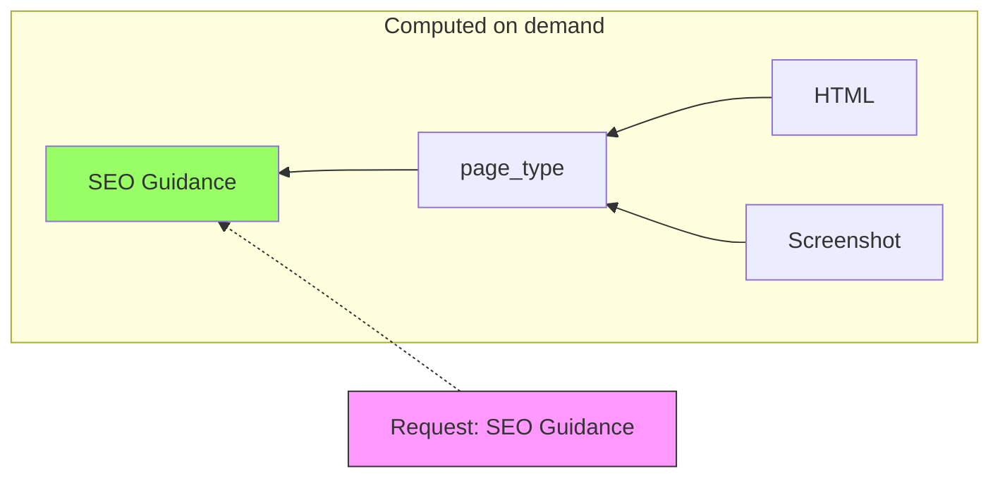

**Cascade Invalidation:** HTML changes → page_type marked obsolete → downstream facts recomputed.

**Semantic hashing:** Detect if content actually changed (pHash for images, DOM hash for HTML).

---

# Benefits

| Benefit | Description | Status |
|---------|-------------|--------|
| **~95% compute savings** | Only recompute when inputs change | Infrastructure ready* |
| **~80% LLM cost savings** | Shared facts eliminate duplicates | Infrastructure ready* |
| **Cross-oppie awareness** | Agents can see all page/site facts | ✅ Implemented |
| **Holistic opportunities** | No contradictory suggestions | ✅ Implemented |
| **User preferences** | "Keep that page unchanged" | ⏳ Planned |
| **Faster DX** | Test individual facts, not whole pipeline | ✅ Implemented |
| **Data lineage** | Track where every fact came from | ✅ Implemented |

*Cost savings infrastructure deployed (TTL caching, change detection with 8 algorithms, shared fact registry). Actual savings require production metrics - not yet measured.

---

# Deep Dive: Audit Migration

---

# SpaceCat Evolution

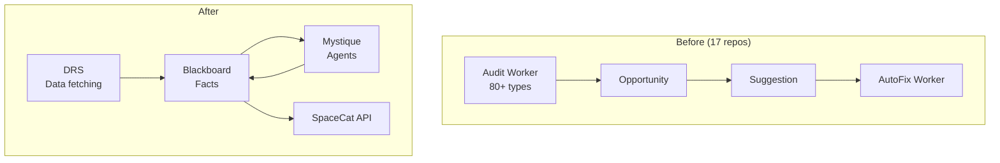

- Audits delegated to Mystique, run as "agents"
- DRS standalone for data fetching / postprocessing
- Opportunities & Suggestions become "facts" in Blackboard
- Keep existing APIs, change behind the scenes

---

# Migration Approach

**Separate 2.0 deployment:**
- Segregates persistence from current production
- Controls blast radius
- Enables clean customer migration vs in-place risk

**Team enablement:**
- Team members migrate oppties as learning opportunity
- Iterative improvement for the new flow
- Each migration improves the process

**API compatibility:**
- Keep existing SpaceCat APIs
- Change implementation behind the scenes

---

# Rollout Phases

| Phase | Description |
|-------|-------------|
| **Phase 1** | Brand Presence pilot (a.com) |
| **Phase 2** | Migration of other oppties |
| **Phase 3** | Additional customers |

Progressive, feature-flagged rollout with monitoring and rollback capability.

---

# Deep Dive: Eval & Self-Learning

---

# Eval Framework Overview

**Already in branch:**
- Offline evals (datasets, evaluators)
- LangFuse integration for tracing

**Self-Learning Workflow:**

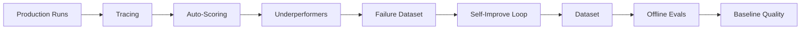

---

# LangFuse Integration

**Done:**
- Tracing production runs
- Auto-scoring outcomes

**Surfacing underperformers:**
- Low-scoring runs collected into failure dataset
- Feed datasets into self-improving workflows
- Re-evaluate continuously

**Full power when:**
- Facts available from migrated agents
- Rich context enables better evaluation

---

# Self-Improvement Workflow

| Step | Description |
|------|-------------|
| **1. Offline Evals** | Create dataset, write evaluators, establish baseline |
| **2. Live Evals** | Trace production runs, auto-score, surface underperformers |
| **3. Failure → Learning** | Collect low-scoring runs, feed to self-improve, re-evaluate |

**Goal:** Learning becomes the primary focus over software development.

We know we're winning when there's no more software to write that improves outcomes — only better data and better evals.

---

# Use Cases

---

# ASO Opportunity: Before (HOTLCTR)

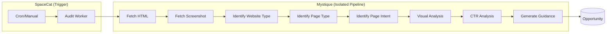

🟡 = Cached/Shared

**Problems:** All 8 steps run every time (~20 min). Nothing cached. Same facts computed by 5+ other agents.

---

# ASO Opportunity: After (HOTLCTR)

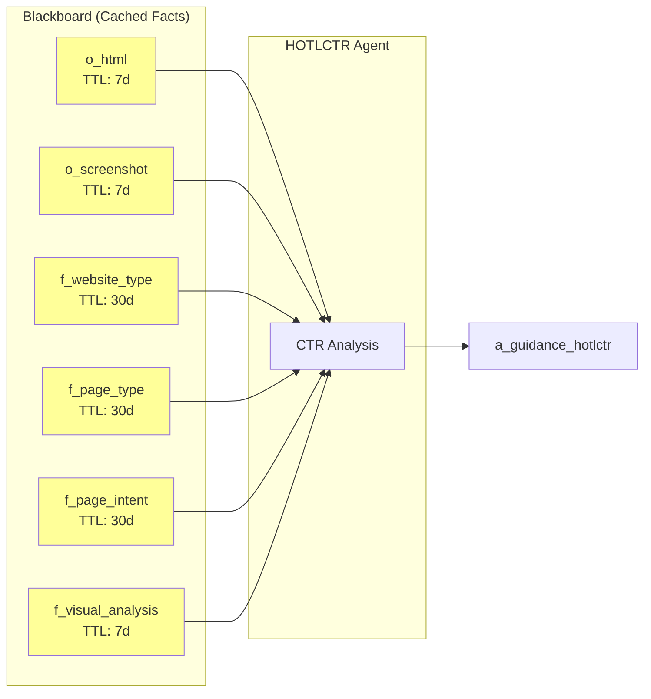

🟡 = Cached/Shared

| Fact | Scope | TTL | Also used by |
|------|-------|-----|--------------|
| o_html | page | 7d | 8 agents |
| o_screenshot | page | 7d | 5 agents |
| f_website_type | site | 30d | 5 agents |
| f_page_type | page | 30d | 6 agents |
| f_page_intent | page | 30d | 6 agents |
| f_visual_analysis | page | 7d | 5 agents |

**Benefits:** 6 facts already cached from other agents. ~95% compute savings.

---

# LLMO Opportunity: Before (Brand Presence)

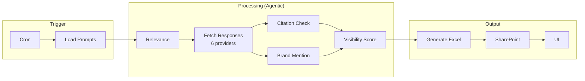

🟡 = Cached/Shared

**Problems:** 15,000 LLM calls/run (agentic). Excel files. Nothing cached. Recomputes everything.

---

# LLMO Opportunity: After (Brand Presence)

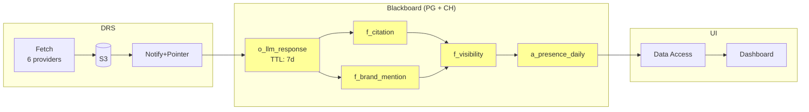

🟡 = Cached/Shared

| Fact | Scope | TTL | Reuse |
|------|-------|-----|-------|
| o_llm_response | prompt+provider+region | 7d | Shared if same prompt text (rare across brands) |
| f_citation | brand+prompt+provider | ∞ | Deterministic - never recompute |
| f_brand_mention | brand+prompt+provider | ∞ | Same input = same output |
| f_visibility | brand+prompt+provider | ∞ | Deterministic formula |
| a_presence_daily | brand+date | 1d | Refreshed daily, queryable |

*Prompt sources: customer-curated (brand-specific), Ahrefs (brand-specific), AI-generated (global/per-industry → shared across brands)*

**Benefits:** One-shot + batch API. Facts cached. 98.5% cost reduction.

---

# Holistic Opportunities

**Problem:** Optimizing one page can degrade metrics on other pages.

| Scenario | Local Win | Site-Wide Impact |
|----------|-----------|------------------|
| Add CTA to homepage | +5% clicks | Cannibalize product pages |
| Improve page A ranking | +10% traffic | Page B loses featured snippet |
| Shorten title for SEO | Better SERP display | Loses brand consistency |

**Solution:**
- Cross-oppie awareness prevents contradictory suggestions
- Cross-page opportunities - site-level context informs page-level recommendations
- "What should I work on today?" prioritization across all oppties

---

# Adding a New Opportunity

**Developer Experience with Claude Code:**

| Step | Description |
|------|-------------|
| **1. Discovery** | Claude Code shows available facts in the blackboard |
| **2. Schema Design** | Generates Pydantic models for type safety |
| **3. Agent Creation** | Uses `@consumes` / `@produces` decorators |
| **4. Proactive Testing** | *"I found 847 homepages. Want to test on real data?"* |
| **5. Validation** | Run on sample, iterate on prompts |
| **6. Scale** | Enable for batch processing |

Compose existing facts — don't start from scratch.

---

# What This Unlocks

---

# Base Problems Addressed

| Problem | How It's Solved |
|---------|-----------------|
| **Agent Quality** | Evals, self-learning, facts-based testing |
| **Agent Performance** | Caching, cascade invalidation, ~95% compute savings |
| **Agent Testability** | Fact-level testing, offline evals |
| **Dual Stack Pain** | Data service, single codebase |
| **Developer Experience** | Claude Code workflow, compose facts |
| **Developer Velocity** | Don't start from scratch, reuse facts |

---

# New Capabilities

| Capability | Description |
|------------|-------------|
| **Preflight Integration** | Real-time validation using cached facts (<500ms vs 5-10s) |
| **Holistic Site Optimization** | Cross-page awareness, no cannibalization |
| **Cross-Oppie Awareness** | No contradictory suggestions |
| **"What Should I Work On Today?"** | Chat that taps into memory + reasoning + prioritized opportunities |

Only possible because of unified facts + cross-oppie awareness.

---

# Execution

---

# Constraints & Timeline

**Target:** 2 months

**Approach:** Progressive release
- Feature-flagged rollout
- Monitoring and rollback capability
- Customers migrated incrementally

**Not a rewrite:** Separate deployment to control blast radius.

---

# Milestones

| Milestone | Description |
|-----------|-------------|
| **M1** | Data Service schema + Data Access Service |
| **M2** | Blackboard facts model + basic producers |
| **M3** | First oppie migrated (Brand Presence pilot) |
| **M4** | Eval framework integrated with facts |
| **M5** | Additional oppties migrated |
| **M6** | Customer migration begins |

*TBD: Detailed timeline and assignments*

---

# Resourcing

**Decision point for leadership:**
- How many engineers?
- Who will work on it?
- SpaceCat vs Mystique allocation?

**Change management:**
- SpaceCat engineers moving from JS to Python
- Enablement plan needed
- AI-first development may address many concerns

---

# Risks & Mitigations

| Risk | Mitigation |
|------|------------|
| **Change management (JS → Python)** | AI-first development, enablement plan |
| **Migration complexity** | Progressive rollout, feature flags, rollback |
| **AI capacity limits** | Facts caching reduces token usage by ~80% |
| **Scope creep** | Focus on base problems first |

---

# Accountability

**Manager responsibility for agent quality:**
- Supported by eval-fed dashboard
- Visibility into agent performance metrics
- Clear ownership of quality outcomes

**Learning-centric culture:**
- Success measured by eval improvements
- Datasets and evaluators as first-class artifacts
- Continuous improvement loops

---

# Questions?

**Resources:**
- Visualization: [Blackboard Visualization](https://experience-platform-mystique-deploy-ethos102-stage-33b975.stage.cloud.adobe.io/blackboard-visualization/) or locally at `http://localhost:8080/bb/`
- Docs: `docs/blackboard/` in Mystique repo, `blackboard-architecture` branch
- Architecture: [docs/blackboard/01-architecture/architecture.md](../01-architecture/architecture.md)
- Data Service: [docs/blackboard/data-service/proposal-data-service.md](../data-service/proposal-data-service.md)
- Developer Experience: [docs/blackboard/dev-experience/](../dev-experience/)
