# AI Agent Evaluations & Prompt Optimization

## A Guide to Mystique's Evaluation Framework

**Duration: 20 minutes**

---

# Slide 1: Agenda

## What We'll Cover Today

1. **Tracing** - Observability for AI agents
2. **LLM-as-Judge Evaluation** - Automated quality scoring
3. **Dataset Management** - Building effective test sets
4. **Evaluation Use Cases** - Regressions, CI/CD, tracking
5. **Prompt Optimization** - Automated improvement

---

# Slide 2: The Problem

## Why Do We Need This?

### Without Observability & Evaluation:
- "It works on my machine" syndrome
- No way to measure improvement
- Regressions go unnoticed
- Subjective quality assessments

### With This Framework:
- **Full visibility** into agent behavior
- **Measurable quality** across dimensions
- **Regression detection** before production
- **Automated improvement** of prompts

---

# PART 1: TRACING

---

# Slide 3: What is Tracing?

## Observability for AI Agents

Tracing captures everything that happens when an agent runs:
- Input queries and context
- LLM calls and responses
- Tool invocations
- Final output

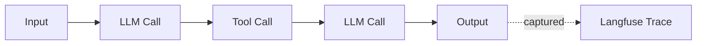

---

# Slide 4: Tracing with Langfuse

## What Gets Captured

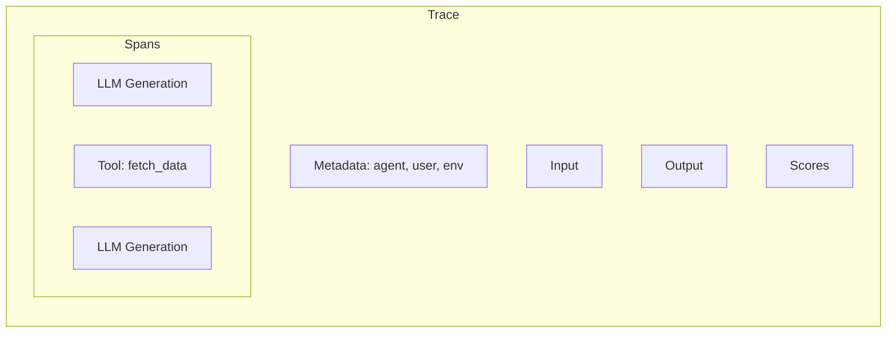

### Benefits:
- **Debug failures** - See exactly what went wrong
- **Analyze patterns** - Understand agent behavior
- **Attach scores** - Link evaluations to traces
- **Compare runs** - Track changes over time

**Status as in December 2025**: most of the Mystique agents & crews are now traced with Langfuse

---

# PART 2: LLM-AS-JUDGE EVALUATION

---

# Slide 5: What is LLM-as-Judge?

## Automated Quality Assessment

Instead of manual human review, we use an LLM to evaluate agent responses.

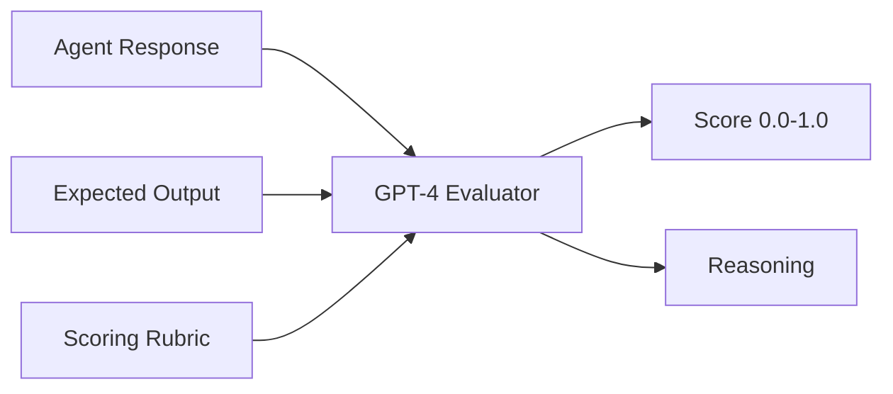

### What are the criteria?

Dependent of local agent or crew business logic.

---

# Slide 6: Evaluation Dimensions

## Multi-Dimensional Quality Assessment

Example dimensions

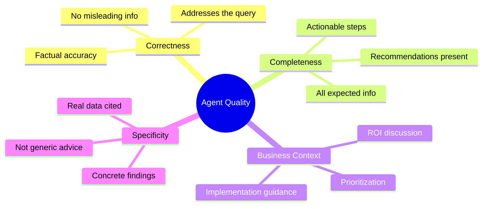

---

# Slide 7: Specificity - The Key Dimension

## Good vs. Bad Responses

### Good Response (Score: 0.9)
> "Your opportunity found **15 broken links** on **8 pages**, including /checkout and /pricing."

### Bad Response (Score: 0.2)
> "You should audit your pages for broken links to improve user experience."

**Key Insight:** Agents should report findings, not assign homework.

---

# Slide 8: How Scoring Works

## The Evaluation Flow

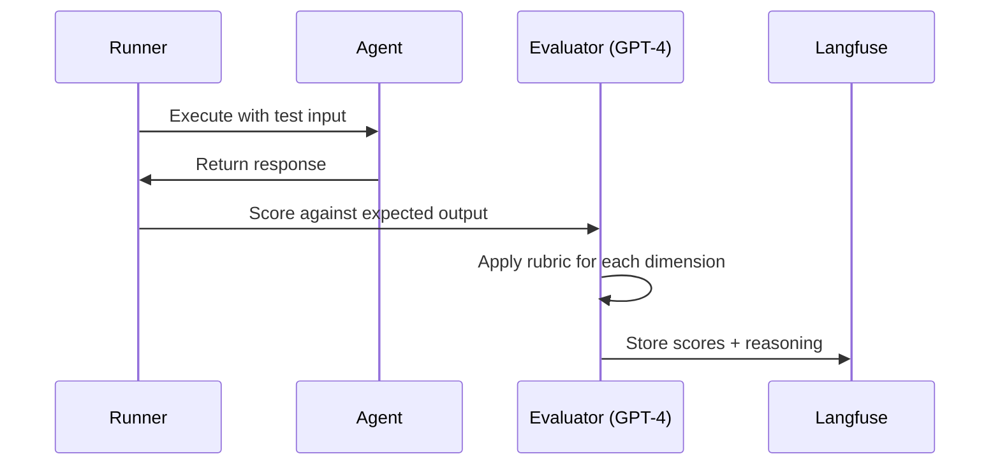

Each response gets 4 scores (one per dimension) with explanations.

---

# PART 3: DATASET MANAGEMENT

---

# Slide 9: What is an Evaluation Dataset?

## The Foundation of Quality Measurement

A dataset is a collection of test cases, each containing:

| Field | Description | Example |
|-------|-------------|---------|
| **Input** | Query sent to agent | "What SEO issues does my site have?" |
| **Expected Output** | What response should contain | "Should mention broken links, meta tags" |
| **Metadata** | Tags for filtering | skill: "seo", difficulty: "medium" |

Note that **Expected Output** is not necessarily verbatim. It might contain info to drive measurements across score dimensions.

---

# Slide 10: Dataset Sources

## Where Test Cases Come From

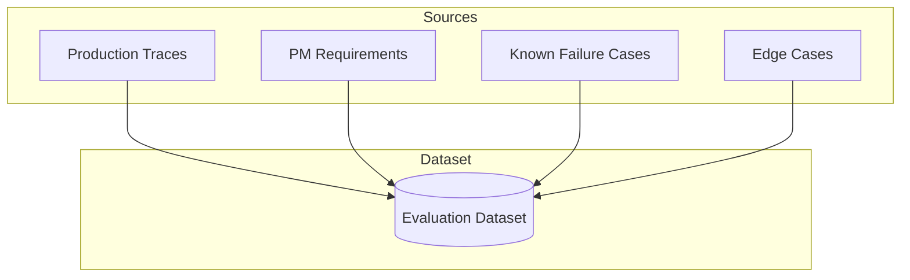

### Each source adds value:
- **Production traces** - Real user questions
- **PM requirements** - Expected behaviors
- **Failure cases** - Problems to prevent
- **Edge cases** - Stress test scenarios

---

# Slide 11: Human-Annotated Assertions

## Item-Specific Expected Values

Generic expectations aren't enough. Humans must add **specific assertions** per test case.

### Example: Testing a Page Analyzer

| Input | Human-Added Assertion |
|-------|----------------------|
| "How many broken links on /checkout?" | `assert broken_links == 3` |
| "What's the page load time?" | `assert mentions "2.4 seconds"` |
| "List all images without alt text" | `assert image_count >= 5` |

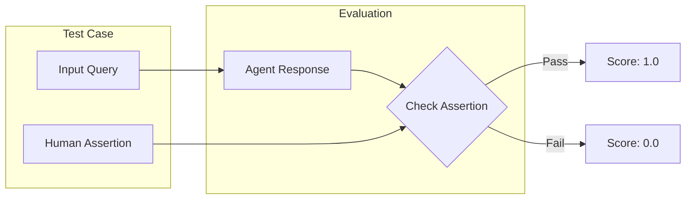

---

# Slide 12: Building Quality Datasets

## Best Practices

### Do:
- Add **specific numeric assertions** where possible
- Include **diverse query variations**
- Tag with **metadata** for filtering
- Update when **requirements change**

### Don't:
- Use only generic expectations
- Skip edge cases
- Let datasets become stale
- Ignore production failures

---

# PART 4: EVALUATION USE CASES

---

# Slide 13: Use Case 1 - Tracking Over Time

## Measuring Agent Quality Trends

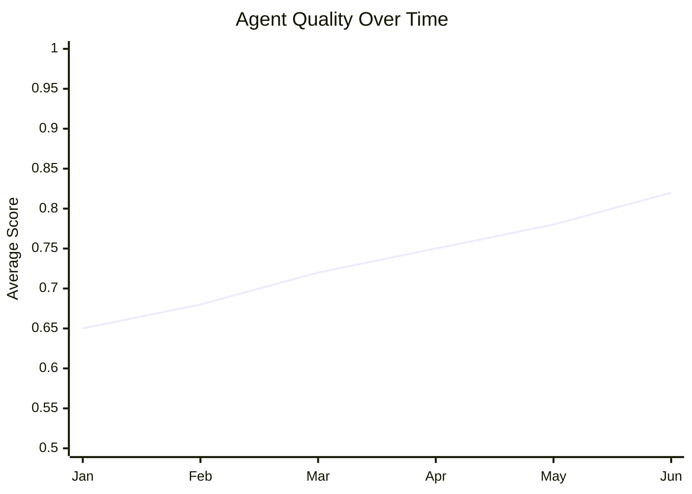

### What to track:
- Overall average score
- Per-dimension trends
- Lowest-performing test cases
- New failure patterns

---

# Slide 14: Use Case 2 - Regression Detection

## Catching Problems Before Production

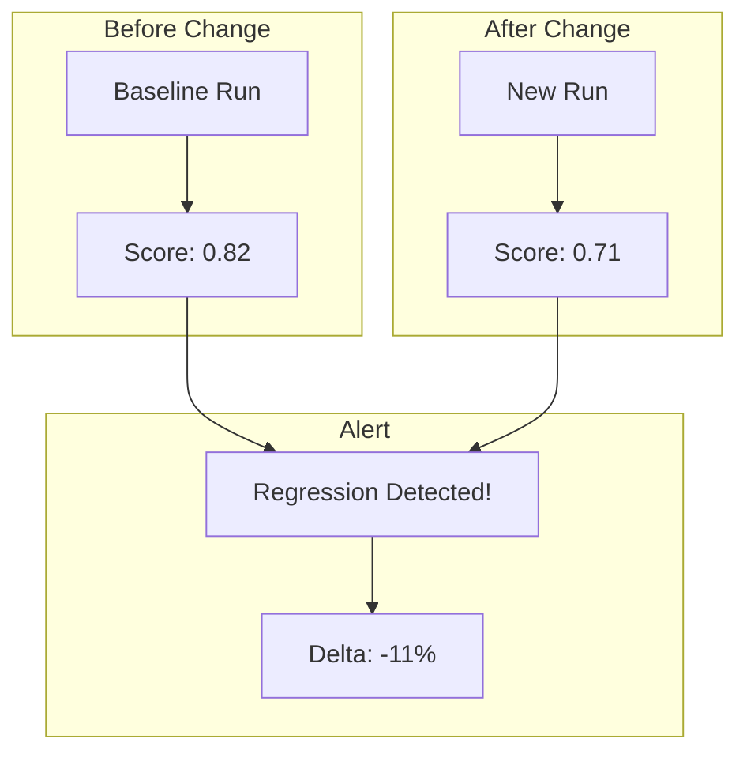

### Regression triggers:
- Score drops below threshold
- Specific dimension degrades
- Previously passing tests fail

---

# Slide 15: Use Case 3 - CI/CD Integration

## Automated Quality Gates

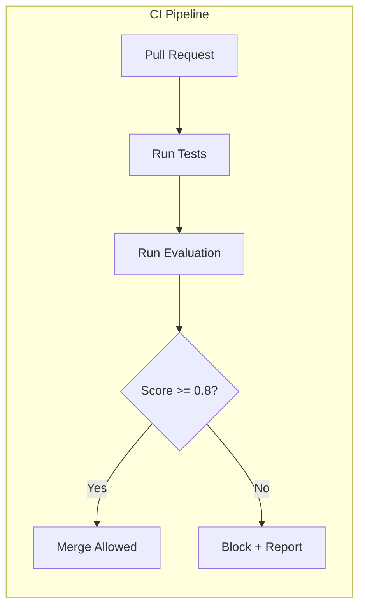

### Integration points:
- **Pre-merge** - Block PRs that degrade quality (too slow)
- **Post-deploy** - Verify production behavior
- **Scheduled** - Nightly quality checks
- **On-demand** - Manual evaluation runs

---

# Slide 16: Evaluation Results

## What You Get

### Per-Run Summary:

| Metric | Value |
|--------|-------|
| Total test cases | 50 |
| Average score | 0.84 |
| Passing (>0.7) | 45 |
| Failing (<0.7) | 5 |

### Per-Dimension Breakdown:

| Dimension | Score | Trend |
|-----------|-------|-------|
| Correctness | 0.88 | +2% |
| Completeness | 0.85 | +1% |
| Business Context | 0.79 | -1% |
| Specificity | 0.82 | +3% |

---

# PART 5: PROMPT OPTIMIZATION

---

# Slide 17: The Optimization Problem

## Manual Prompt Engineering is Hard

### Challenges:
- Time-consuming trial and error
- Hard to know what to change
- Easy to break what works
- No systematic approach
- Lots of prompts to change

### Solution:
Use LLMs to improve LLM prompts automatically, guided by evaluation scores.

---

# Slide 18: Optimization Loop

## How It Works

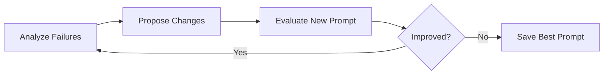

### The cycle:
1. **Analyze** - Find patterns in low-scoring responses
2. **Propose** - Generate targeted prompt improvements
3. **Evaluate** - Test new prompt on full dataset
4. **Decide** - Keep if better, stop if converged

---

# Slide 19: Failure Analysis

## Understanding What Went Wrong

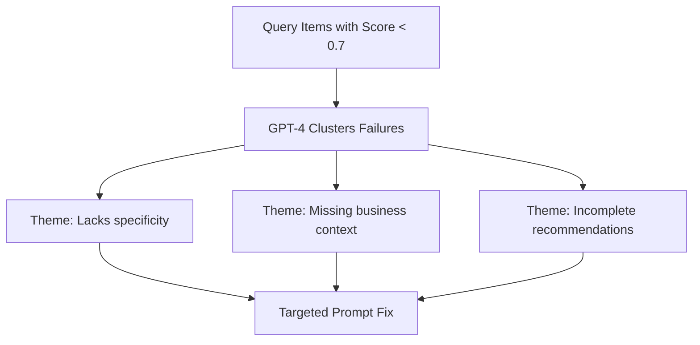

### Example theme:
> **"Responses lack specificity"**
> - 6 of 20 test cases affected
> - Agent gives generic advice instead of citing data
> - Fix: Add instruction to always include numbers

---

# Slide 20: Optimization Progress

## Tracking Improvement

| Iteration | Score | Change | Action |
|-----------|-------|--------|--------|
| Baseline | 0.65 | - | Starting point |
| 1 | 0.72 | +7% | Keep |
| 2 | 0.76 | +4% | Keep |
| 3 | 0.74 | -2% | Revert |
| 4 | 0.77 | +1% | Stop (converged) |

### Stopping conditions:
- Max iterations reached
- Improvement below threshold (2%)
- Scores regressing

**Final improvement: +18%**

---

# Slide 21: Key Principle

## Surgical Changes, Not Rewrites

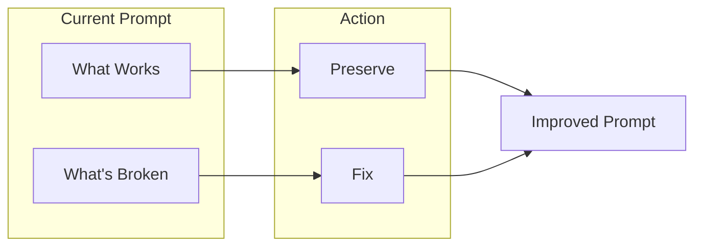

- **Keep what works** - Don't break good behavior
- **Fix what's broken** - Target specific failures
- **Learn from history** - Don't repeat failed attempts

---

# Slide 22: Summary

## Key Takeaways

1. **Tracing** provides visibility into agent behavior via Langfuse. Done.

2. **LLM-as-Judge** enables scalable, consistent quality scoring

3. **Datasets** require human-annotated, item-specific assertions

4. **Evaluation use cases**: tracking trends, catching regressions, CI/CD gates

5. **Prompt optimization** automates improvement using evaluation feedback

### Next Steps:
- Create a dataset for your agent/crew/opportunity
- Add specific assertions to each test case
- Run baseline evaluation
- Set up regression detection

---

# Slide 23: Questions?

## Resources

- **Documentation:** [docs/evals/README.md](../README.md)
- **Quick Start:** [docs/evals/QUICKSTART.md](../QUICKSTART.md)
- **Prompt Optimization:** [docs/evals/PROMPT_OPTIMIZATION.md](../PROMPT_OPTIMIZATION.md)

---

*Mystique Evaluation Framework*
*December 2025*
