# Blackboard Architecture

## Service Interactions Deep Dive

> **Last Updated:** 2026-02-05
> **Note:** This document describes the **target architecture**. Current implementation uses direct method calls (not SNS/SQS). See implementation status notes on each slide.

---

# Slide 1: The 4 Services at a Glance

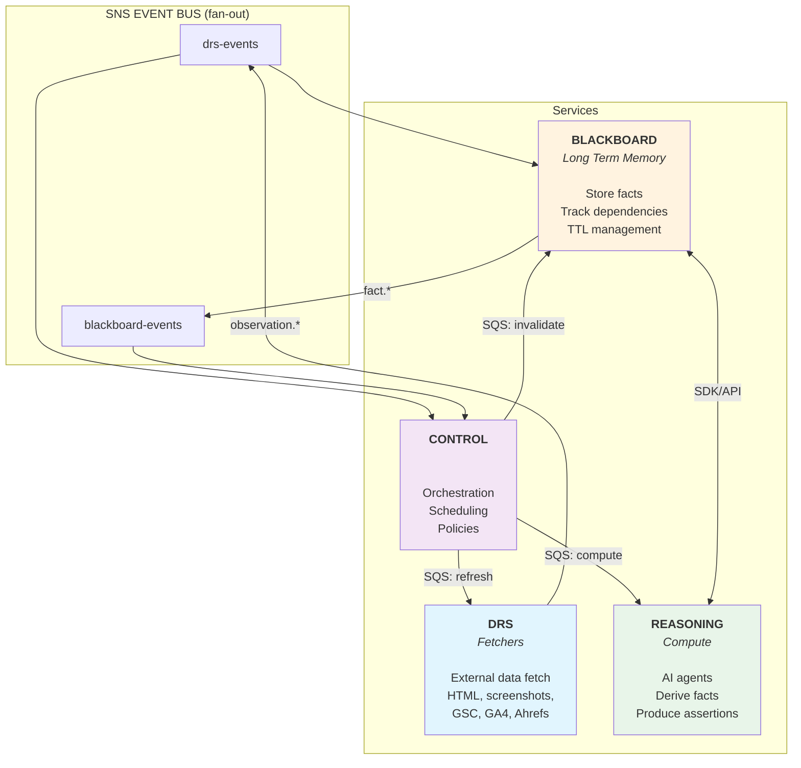

## Service Roles

| Service | Responsibility |
|---------|----------------|
| **DRS** | Fetch external data (HTML, screenshots, GSC, GA4, Ahrefs) |
| **Blackboard** | Central fact store, dependency tracking, TTL management |
| **Control** | Orchestration, scheduling, cascade policies |
| **Reasoning** | AI agents that consume facts and produce derived facts |

---

# Slide 2: DRS <-> Blackboard

## Pattern: Notify + Pointer

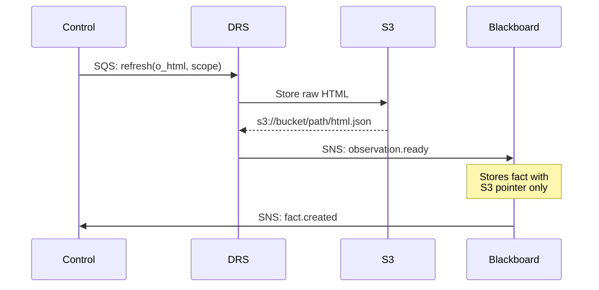

## Why Notify + Pointer?

- **Large data** (HTML, screenshots, Lighthouse) stays in S3
- **Facts table** stores only pointers + metadata
- **Efficient queries** without loading blobs

> **Implementation Status:** Pattern partially implemented. DRS stores results, `ObservationBridge` processes them, but uses direct method calls instead of SNS events. Screenshots stored as inline base64 (not S3 pointers).

---

# Slide 3: DRS <-> Control

## Control Commands DRS to Fetch Data

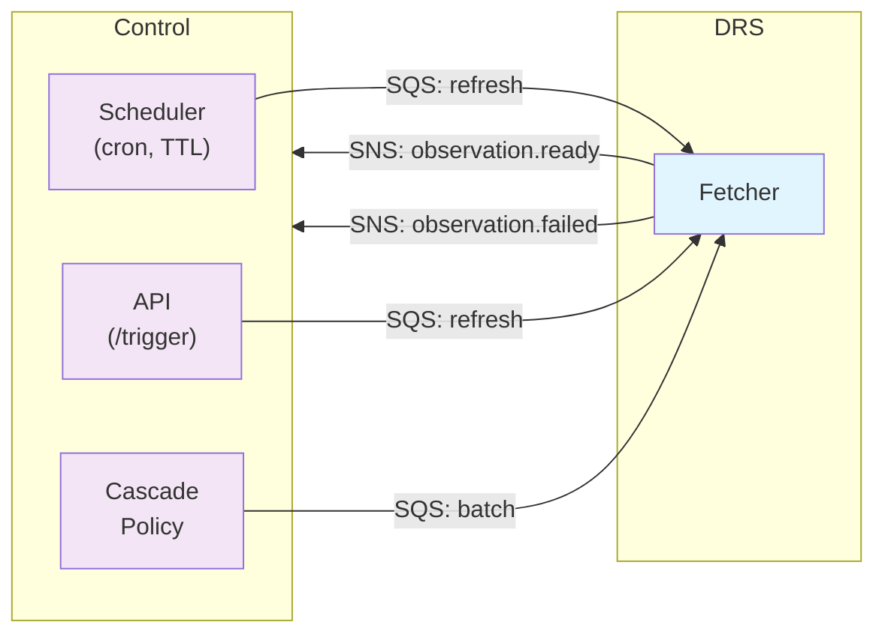

## Commands (Control -> DRS via SQS)

| Command | Purpose |
|---------|---------|
| `refresh(key, scope)` | Fetch fresh observation (o_html, o_screenshot, etc.) |
| `batch(operations[])` | Batch fetch multiple pages/observations |

## Events (DRS -> Control via SNS)

| Event | Trigger |
|-------|---------|
| `observation.ready` | Fetch completed successfully |
| `observation.failed` | Fetch failed (triggers retry/alert) |
| `batch.completed` | Batch job finished |

## Trigger Sources

- **Scheduled**: Control's cron (e.g., weekly refresh)
- **Manual**: API call to `/v1/control/trigger`
- **Cascade**: Upstream fact became stale

> **Implementation Status:** TierScheduler orchestrates scans and DRS calls. Currently uses direct Python method calls, not SQS queues. SNS events planned for Phase 3.

---

# Slide 4: TierScheduler - Main Computation Path

> **Note on execution model:** HA mode with distributed TaskWorkers is the required production architecture (see Slide 7b and 10). PlanExecutor shown in this slide is the current interim path (used in all modes today — Phase 3 not yet wired). See [ha-architecture.md](../decisions/ha-architecture.md).

## Scheduled Scans Drive Fact Computation

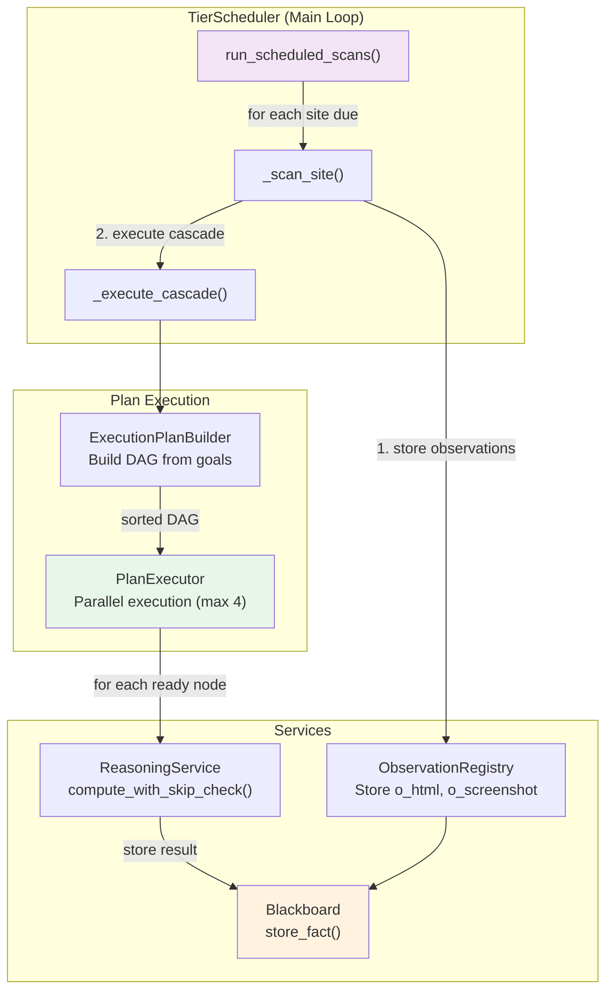

## Execution Flow

| Step | Component | Action |
|------|-----------|--------|
| 1 | TierScheduler | Check which sites are due (by tier frequency) |
| 2 | ObservationRegistry | Store observations (o_html, o_screenshot, o_pagespeed) |
| 3 | ExecutionPlanBuilder | Build DAG from goal facts, topologically sort |
| 4 | PlanExecutor (current interim) / TaskWorker (HA target) | Execute nodes in parallel (respecting dependencies) |
| 5 | ReasoningService | Semantic diff check → compute → store to Blackboard |

## Key Features

- **Distributed execution**: 75 concurrent coroutines per worker pod via PostgreSQL task queue (production)
- **Cascade skip**: If upstream unchanged, downstream automatically skipped
- **Semantic diff**: `compute_with_skip_check()` detects unchanged inputs
- **Goal-driven**: Tier config specifies `enabled_opportunity_types` as goals

> **This is how 95%+ of fact computation happens** - via scheduled tier scans, not event-driven cascades. Currently runs via PlanExecutor in-process (interim). HA mode with distributed TaskWorkers is the required production architecture (Phase 3 wires this).

---

# Slide 4b: Cascade Policies (Secondary Mechanism)

## Event-Driven Cascades for Ad-Hoc Triggers

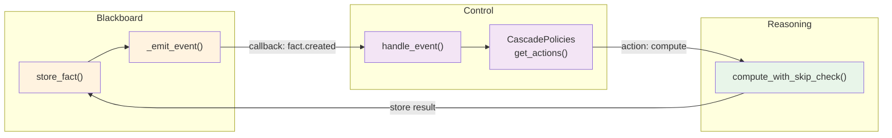

## When Cascade Policies Are Used

| Trigger | Example |
|---------|---------|
| **External observation push** | SpaceCat sends new CWV data → triggers dependent derivations |
| **Manual fact creation** | API call creates o_html → policies trigger d_page_classification |
| **Distributed task queue** | TaskWorkers process compute_fact tasks from PostgreSQL queue (primary production path) |

## Event Types

| Event | Handler | Status |
|-------|---------|--------|
| `fact.created` | `_on_fact_created()` | ✅ Looks up policies, triggers compute |
| `fact.updated` | `_on_fact_updated()` | ✅ Falls back to on_created policies |
| `fact.removed` | `_on_fact_removed()` | ✅ Triggers downstream recomputation |
| `fact.stale` | `_on_fact_stale()` | ⏳ Logs only (refresh not implemented) |

## Policy Structure

```python
CascadePolicy(
    trigger_fact_key="o_html",      # When this fact changes...
    trigger_event_type="on_created",
    action_type="compute",           # ...compute this target
    action_target="d_page_classification",
    scope_filter={"tiers": ["paid_starter", "paid_pro"]},  # Optional tier filtering
)
```

> **Note:** HA mode is the required production architecture: SiteScheduler claims due sites, TaskWorker executes tasks from the distributed PostgreSQL queue. Currently, PlanExecutor is used in all modes for per-page cascades (Phase 3 not yet wired).

---

# Slide 5: Blackboard <-> Reasoning

## Direct SDK Calls (Same Process)

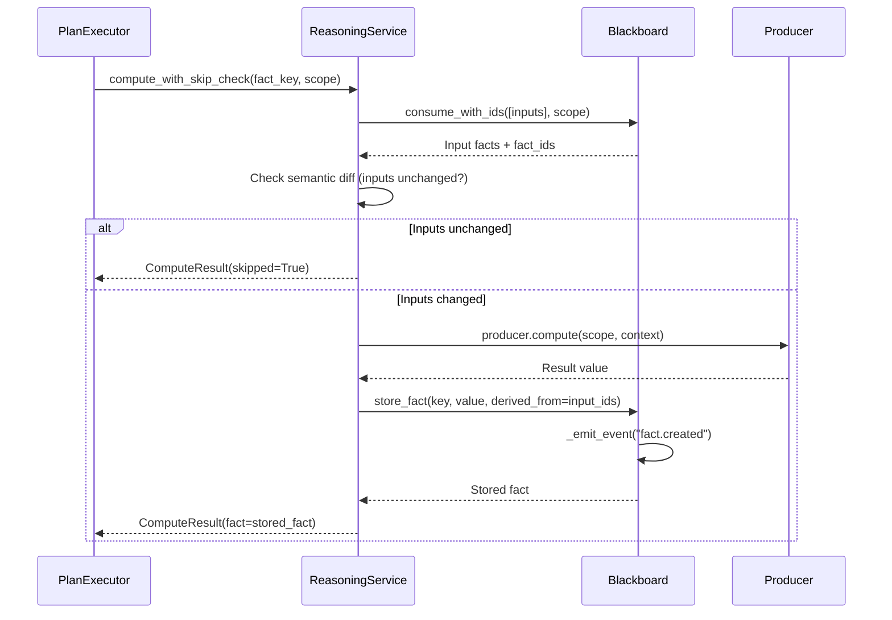

## SDK Calls (Reasoning -> Blackboard)

| Call | Purpose |
|------|---------|
| `blackboard.consume(fact_keys, scope)` | Get input facts for computation |
| `blackboard.consume_with_ids(fact_keys, scope)` | Get inputs + their IDs for lineage |
| `blackboard.store_fact(key, value, derived_from)` | Write derived fact with lineage |

---

# Slide 6: Control <-> Reasoning

## TaskWorker / PlanExecutor Orchestrates Fact Computation

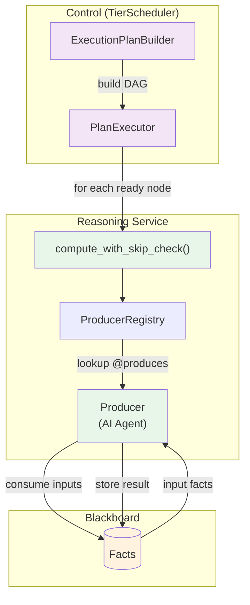

## Execution Model

| Aspect | Implementation |
|--------|----------------|
| **HA target (required for production)** | Task queue enqueue → TaskWorker claims via SKIP LOCKED |
| **Current interim** | PlanExecutor runs in-process (used in all modes today; Phase 3 wires task queue) |
| **Parallelism** | 75 concurrent coroutines per worker pod |
| **Skip detection** | Semantic diff on input facts |
| **Cascade skip** | If upstream skipped, downstream auto-skipped |

## Reasoning Computation Flow

1. PlanExecutor (current interim) or TaskWorker (HA target) calls `reasoning.compute_with_skip_check(fact_key, scope)`
2. Lookup `@produces("d_page_classification")` → finds `PageClassificationProducer`
3. Get `@consumes` → needs `o_html`, `o_screenshot_desktop`
4. Call `blackboard.consume_with_ids()` to get inputs + their fact IDs
5. **Semantic diff check**: Compare current inputs vs inputs used for existing fact
6. If unchanged → return existing fact (skip computation)
7. If changed → execute `producer.compute()` → store result with lineage

## HA Task Queue Execution

```
TierScheduler._execute_cascade()
  └── task_queue.enqueue_task(handle_compute_fact, {fact_key, scope})

TaskWorker (separate process)
  └── claim_task() → SKIP LOCKED query
        └── handle_compute_fact() → reasoning.compute_with_skip_check()
```

| Aspect | Implementation |
|--------|----------------|
| **Claiming** | PostgreSQL `SKIP LOCKED` for contention-free task claiming |
| **Parallelism** | 75 concurrent coroutines per worker pod |
| **Lease renewal** | Every 100s, 30s timeout grace |
| **Task types** | `handle_compute_fact`, `handle_scan_site` |
| **Env vars** | `CONTROL_HA_ENABLED=true`, `CONTROL_HA_TASK_WORKER=true` |

> See **Slide 10** for full HA architecture (leaderless workers, Aurora sizing).

---

# Slide 7: Complete Flow Example

## Scenario: Page HTML Changes -> Cascade to Recommendations

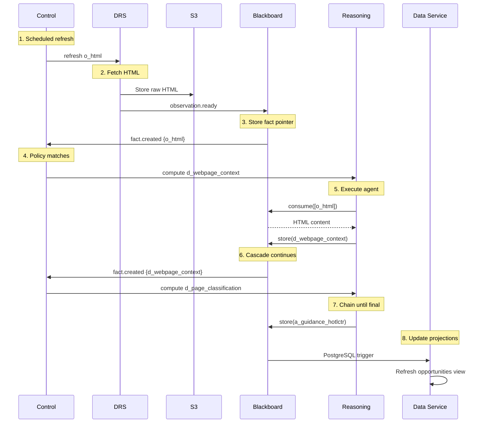

## Design Principles

| Principle | Description |
|-----------|-------------|
| **Reflective pattern** | Control (meta-level) decides; others execute |
| **Event-driven** | All services decouple via SNS/SQS |
| **Explicit dependencies** | `@consumes/@produces` decorators |
| **Idempotent commands** | Safe retries and deduplication |

---

# Slide 7b: HA Task Queue Flow

## Scenario: TierScheduler Triggers Site Scan with Distributed Workers

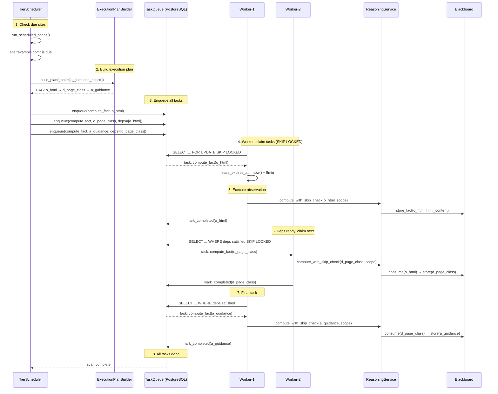

## Key Differences from Event-Driven Flow

| Aspect | Event-Driven (Slide 7) | HA Task Queue (This Slide) |
|--------|------------------------|----------------------------|
| **Trigger** | Fact events cascade one-by-one | All tasks enqueued upfront from DAG |
| **Parallelism** | Sequential cascade | Multiple workers claim in parallel |
| **Failure handling** | Event replay | Lease expiry → task re-claimed |
| **Visibility** | Implicit in event flow | Explicit task queue with status |

## Task Queue States

```
┌─────────┐    claim     ┌────────────┐   success   ┌───────────┐
│ PENDING │─────────────▶│ PROCESSING │────────────▶│ COMPLETED │
└─────────┘              └────────────┘             └───────────┘
     │                         │
     │                         │ lease expires
     │                         ▼
     │                   ┌────────────┐
     └───────────────────│  PENDING   │ (re-claimable)
                         └────────────┘
```

---

# Slide 8: Control - Customer Tier Configuration

## Control Manages Per-Tenant and Per-Site Entitlements

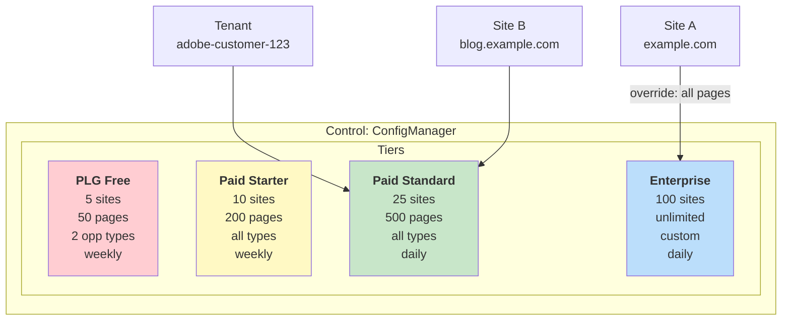

## Tier Hierarchy

| Tier | Sites | Pages/Site | Scan Freq | Opportunities | Features |
|------|-------|------------|-----------|---------------|----------|
| `plg_free` | 5 | 50 | weekly | 2 types only | Basic |
| `paid_starter` | 10 | 200 | weekly | All types | + Preflight |
| `paid_standard` | 25 | 500 | daily | All types | + API access |
| `paid_enterprise` | 100 | unlimited | daily | All + custom | Full |

## Scan Scope Options

| Scope | Description |
|-------|-------------|
| `all` | Every discovered page (paid customers) |
| `top_n` | Top N pages by traffic (default) |
| `sampled` | Statistical sample across page types |
| `sitemap_only` | Only pages in sitemap.xml |

---

# Slide 9a: Thinkers - The Compute Challenge (PLANNED)

> **Implementation Status:** This slide describes **planned compute flavours** (Lambda/Fargate/K8s routing). HA mode with distributed TaskWorkers is the required production architecture. Currently, PlanExecutor runs in-process in all modes (interim, max 4 concurrent via `CONTROL_EXECUTOR_MAX_PARALLEL`). Phase 3 wires the task queue.

## Problem: Reasoning Tasks Have Vastly Different Resource Needs

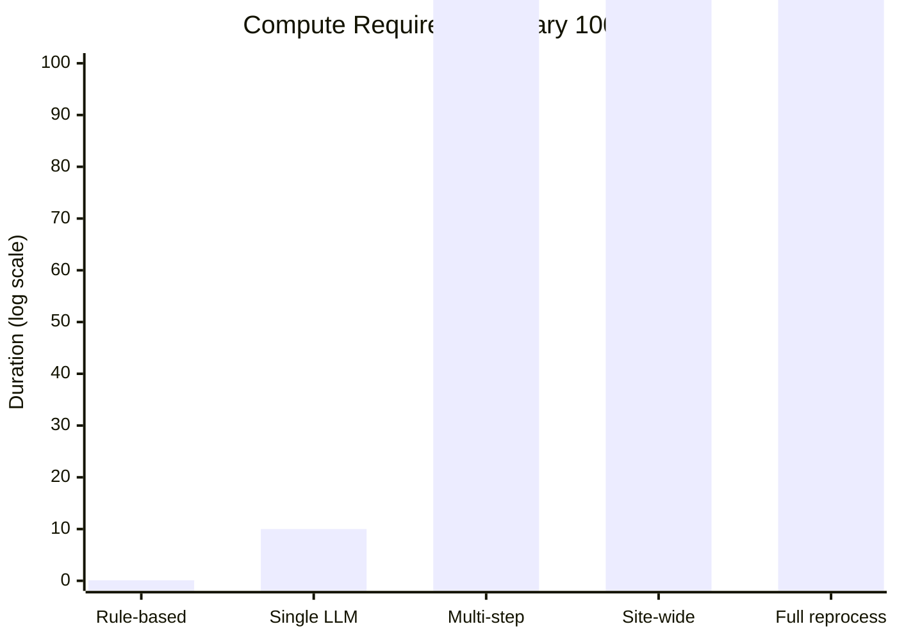

## Resource Variance

| Task                                                   | Duration | Memory | Compute |
|--------------------------------------------------------|----------|--------|---------|
| Rule-based classifier                                  | < 100ms | 128MB | CPU |
| Single LLM call                                        | 1-10s | 512MB | CPU + API |
| Multi-step agents                                      | 30s-5min | 2GB | CPU + API |
| Site-wide analysis                                     | 5min-1hr | 8GB | CPU + API |
| Complex coding agents, Claude Code/skills + sandboxing | 1hr+ | 16GB+ | CPU + GPU |

## Why Single Environment Fails

| If we only use... | Problem                                               |
|-------------------|-------------------------------------------------------|
| In-process only   | Long tasks block the service, OOM risk, not sandboxed |
| Lambda only       | 15min timeout, cold starts, no GPU                    |
| K8s only          | Overkill for simple tasks, slow spin-up               |

**We need tiered compute.**

---

# Slide 9b: Thinkers - Four Compute Environments (PLANNED)

> **Implementation Status:** Only **In-Process** tier is implemented. Lambda/Fargate/K8s routing is designed but not yet built. See [design-compute-flavours.md](../future/design-compute-flavours.md).

## Solution: Match Task to Appropriate Infrastructure

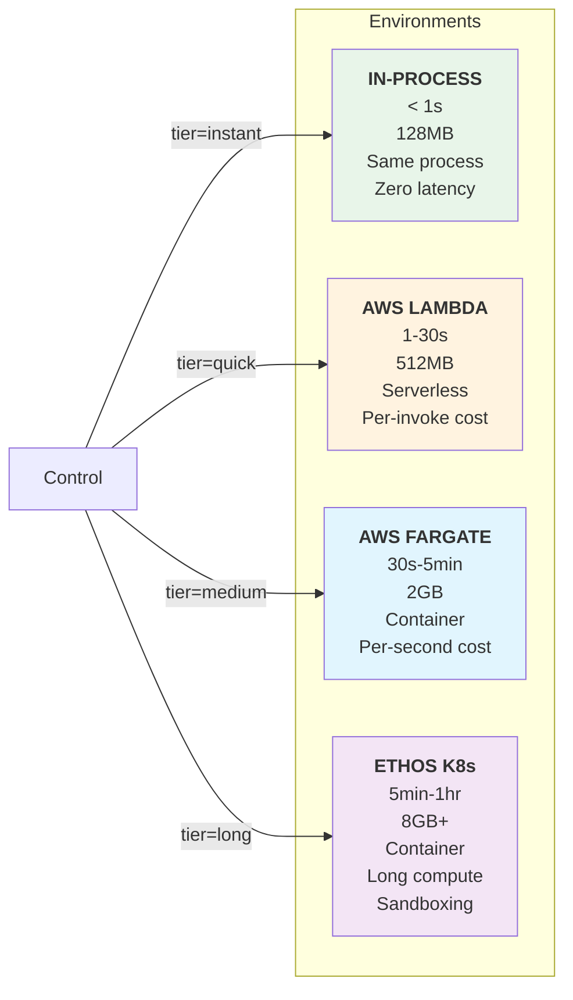

## Environment Comparison

| Environment | Duration | Best For                                      | Trade-offs |
|-------------|----------|-----------------------------------------------|------------|
| **In-Process** | < 1s | Rule-based, lookups, transforms               | Fastest, but blocks if slow |
| **AWS Lambda** | 1-30s | Single LLM call, light processing             | Serverless, but 15min max |
| **AWS Fargate** | 30s-5min | Multi-step agents, batch LLM                  | Flexible, but ~30s cold start |
| **Ethos K8s Jobs** | 5min-1hr | Site-wide analysis, heavy compute, sandboxing | Most powerful, slowest to start |

---

# Slide 9c: Thinkers - Developer Experience (PLANNED)

> **Implementation Status:** `@compute_profile` decorator does **not exist yet**. All producers run in-process. This slide describes the target DX once compute tiers are implemented.

## Developers Declare Tier at Design Time -> Control Routes Automatically

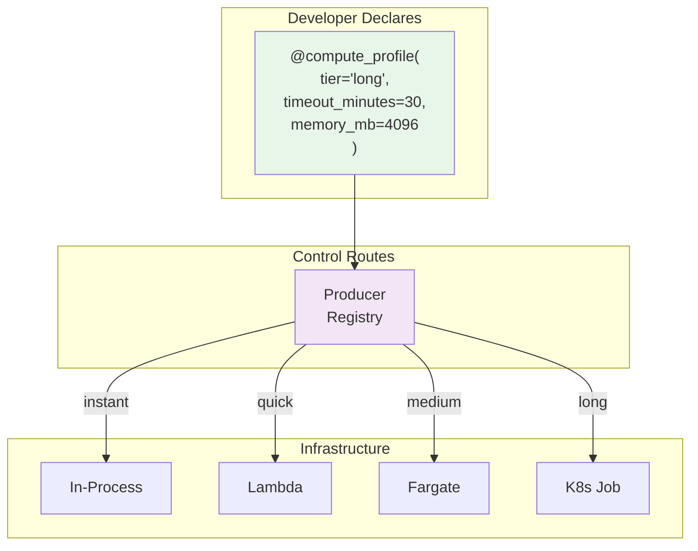

## Control Routing Table

| Declaration | Routes To |
|-------------|-----------|
| `@compute_profile(tier="instant")` | Direct function call (same process) |
| `@compute_profile(tier="quick")` | SQS -> AWS Lambda |
| `@compute_profile(tier="medium")` | SQS -> AWS Fargate |
| `@compute_profile(tier="long")` | SQS -> Ethos K8s Job |

## Real-World Mappings

| Reasoning Task               | Tier | Environment |
|------------------------------|------|-------------|
| Page type classifier         | `instant` | In-process |
| Single guidance (1 LLM call) | `quick` | Lambda |
| HotLCTR multi-step agent     | `medium` | Fargate |
| Site-wide keyword analysis   | `long` | K8s Job |

**Key principle:** The team owning the reasoner decides the tier, not Control at runtime.

---

# Slide 10: Control - High Availability & Scaling

## Distributed Plan Execution

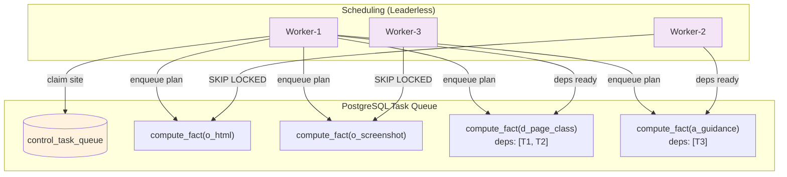

## Why Leaderless?

| Aspect | Leader-Based | Leaderless (Chosen) |
|--------|--------------|---------------------|
| Failure mode | Leader crash → 30s gap | No single point of failure |
| Complexity | Leader election + task queue | Task queue only |
| Mental model | Leader schedules, workers execute | All workers equal |

## Worker Architecture

```
┌─────────────────────────────────────────┐
│         Worker Pod (1 process)          │
│                                         │
│  asyncio event loop                     │
│  ├── task_1 → await llm_call()          │
│  ├── task_2 → await llm_call()          │
│  └── ... (75 concurrent coroutines)     │
│                                         │
│  Memory: ~750MB per pod                 │
└─────────────────────────────────────────┘

4 pods × 75 concurrent = 300 capacity
```

## Sizing Summary

| Component | Spec | Cost |
|-----------|------|------|
| **Worker pods** | 4 × 750MB, 75 coroutines each | K8s resources |
| **Aurora Writer** | db.r6g.xlarge (4 vCPU, 32GB) | ~$320/mo |
| **Aurora Reader** | db.r6g.large (2 vCPU, 16GB) | ~$160/mo |
| **PgBouncer** | Transaction mode, 50 pool size | Sidecar |

## Key Patterns

| Pattern | Purpose |
|---------|---------|
| `SKIP LOCKED` | Contention-free task claiming |
| `LISTEN/NOTIFY` | Reduced polling (wake on new tasks) |
| DAG `depends_on` | Parallel execution respecting dependencies |
| Idempotency keys | Safe retries, no duplicate work |

> **Implementation Status:** Task queue, SKIP LOCKED, DAG depends_on, 75 coroutines per pod - all ✅ implemented. LISTEN/NOTIFY designed but uses polling fallback (1s interval).

> See [ha-architecture.md](../decisions/ha-architecture.md) for full details.

---

# Presentation Summary

| # | Slide | Content |
|---|-------|---------|
| 1 | **Overview** | 4 services at a glance |
| 2 | **DRS <-> Blackboard** | Notify + Pointer pattern |
| 3 | **DRS <-> Control** | Refresh commands, observation events |
| 4 | **TierScheduler** | Main computation path (95%+ of work) |
| 4b | **Cascade Policies** | Secondary event-driven mechanism |
| 5 | **Blackboard <-> Reasoning** | SDK consume/store |
| 6 | **Control <-> Reasoning** | Compute commands, HA task queue execution |
| 7 | **Complete Flow** | End-to-end cascade example (event-driven) |
| 7b | **HA Task Queue Flow** | TierScheduler + distributed workers |
| 8 | **Control Tiers** | Customer tier configuration |
| 9a | **Compute Challenge** | Why we need multiple environments |
| 9b | **Compute Environments** | The 4 supported infrastructures |
| 9c | **Compute DX** | Developer declares, Control routes |
| 10 | **Control HA** | Distributed execution, worker scaling |

---

# Related Documents

- [architecture.md](../01-architecture/architecture.md) - Primary architecture reference
- [data-flow-map.md](../01-architecture/data-flow-map.md) - Data flow diagrams
- [service-commands-events.md](../01-architecture/service-commands-events.md) - Full API reference
- [design-compute-flavours.md](../future/design-compute-flavours.md) - Compute tier exploration (PLANNED)
- [requirements-control-features.md](../future/requirements-control-features.md) - Tier requirements
- [ha-architecture.md](../decisions/ha-architecture.md) - HA infrastructure design
